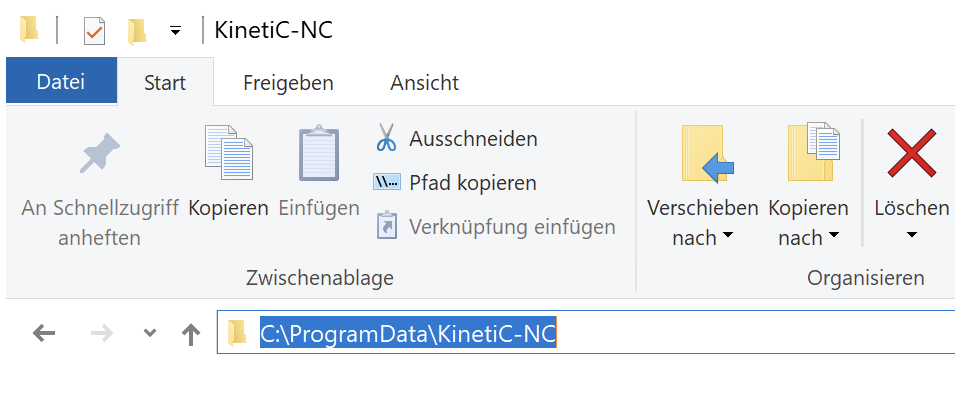

# Fusion Post-Processor for KINETIC-NC

A modified [Autodesk Fusion](https://www.autodesk.com/products/fusion-360) post-processor for the [HIGH-Z S-720/T](https://www.cnc-step.de/cnc-fraese-high-z-s-720t-kugelgewindetrieb-720x420mm) milling machine running the [KINETIC-NC](https://www.cnc-step.de/cnc-software/kinetic-nc-netzwerk-steuerungssoftware/) software, which both are from CNC-Step (https://www.cnc-step.de).

Autodesk Fusion post-processors are written in JavaScript and the documentation of the existing classes, functions, etc., is described in the [Autodesk CAM Post Processor Documentation](https://cam.autodesk.com/posts/reference/index.html).

I made some modifications to the post-processor provided by CNC-Step, in order to make it more convenient for my typical operations. Be aware, that the modifications are tested only the KINETIC-NC software and on my personal machine. KINETIC-NC supports an additional set of specific commands which are not part of the RS-274D standard. KINETIC-NC supports also a macro language, which can be used to automate recurring tasks.

Adding/modifying the functionality of the post-processor is convenient when using the [Visual Studio Code](https://code.visualstudio.com/) editor and the [Autodesk Fusion Post Processor Utility](https://marketplace.visualstudio.com/items?itemName=Autodesk.hsm-post-processor) extension.

Mainly two functions from the post API are employed. The main function needed is **writeln()** which comes with the Fusion JavaScript API. The second one is **writeComment()** which is a wrapper around **writeln()** that just adds brackets before and after the text (this is also the comment format understood by KINETIC-NC).

A third function written by myself is **safeStartPositionChiefenne()**. This is used to go to a "safe" start position. In my setups I have most of the time a situation where my workpiece coordinate system is G54. Further I clamp the stock so that I can safely approach the G54 origin. First I traverse at y=0 along the x-axis (G54 X0), then I move along the y-axis (G54 Y0). The spindel is left at z=0.

## Features

 * General
   - Use the G54 workpiece origin to automate a safe path to the stock (instead of going straight from the machine origin).
   - Prompt the user to confirm, while displaying the current G54 offsets in the KINETIC-NC info window.
 * How it is done (and when)
   - Implemented via subroutine call *safeStartPositionChiefenne()*
   - Before and after tool change (function *onSection()* when tool change is required *insertToolCall*)
   - At program end (function *onClose()*)
 * Jump labels between sections (e.g., 2D adaptive clearing, pockets, etc.)
   - Allows to execute individual sections separately
 * Repeat / Next within each section
   - Allows easily to redo sections multiple times
 * Remove entries not understood by KINETIC-NC (works meanwhile, but still is removed to run on older versions)
   - Remove **%** from last line

## Code snippets

### Snippet 1
Adding a section to [FUSION_360_KINETIC-NC_HIGH-Z_720T.cps](FUSION_360_KINETIC-NC_HIGH-Z_720T.cps) which will always be written to the **\*.nc** file when using this post-processor:

```JavaScript
writeln("");
writeComment("Safe path to workpiece origin - derived automatically from G54 x-coordinate");
writeComment("So we need to switch to G54 before running the program");
writeBlock("G54");
writeln('PRINT "x-offset = ";#900;" mm"');
writeln('PRINT "y-offset = ";#901;" mm"');
writeln('PRINT "z-offset = ";#903;" mm"');
writeln('ASKBOOL "Continue with offsets?" I=2');
writeln("");
```

#### Explanation

```JavaScript
writeln("");
```
Adds an empty line because the string **""** is empty.

```JavaScript
writeBlock("G54");
```
In the *.nc file this renders to:.
```JavaScript
N10 G54
```
The line numbers (Nxx) are automatically generated when using writeBlock().

```JavaScript
writeComment("This is a comment");
```

Write a comment line into the \*.nc file. The result in the file will look like this (the round brackets are added be the function *writeComment* to the text) and KINETIC-NC interprets this as a comment:

```JavaScript
(This is a comment)
```

### Snippet 2

```JavaScript
function safeHomePositionChiefenne() {
    // Run tool to safe position (see chiefenne mods function writeProgramHeader)
    //
    //   machine x,y extent
    //   -----------------------------
    //   |                           |
    //   |                           |
    //   |        ----------         |
    //   |        | stock  |         |
    //   |        |        |         |
    //   |        o---------         |
    //   |                           |
    //   |                           |
    //   0 -------xy------------------
    //
    //   0  ... machine zero (G53)
    //   o  ... stock zero (G54)
    //   xy ... safe position to move to stock origin (G54)
    //
    //
    writeln("");
    writeComment("Go safe to home position: G28 would go shortest path");
    writeBlock(gAbsIncModal.format(53), "(machine coordinates)");
    writeBlock("G0 Z0  (lift spindle)");
    writeBlock("G0 Y0  (move to Y0 before going to home position)");
    writeBlock("G0 X0  (move to machine home position)");

}
```

When calling the function ***safeStartPositionChiefenne()*** in the post processor it renders to the following G-code:

```JavaScript
(Moving to workpiece origin)
N30 G53 (machine coordinates)
N35 G0 Z0  (lift spindle)
N40 G54 (workpiece coordinates)
N45 G1 X0 F1000 (go slow to workpiece origin X)
N50 G1 Y0 F1000 (go slow to workpiece origin Y)
```

The line numbers (Nxx) are automatically generated when using *writeBlock()*.


In the past I added those lines always manually at sevaral positions in the  \*.nc file in order to move safely to the workpiece without crashing into any clamps. For my typical setups I then just needed to adapt the initial x-coordinate in the initial section.

In order to overcome the manual editing, it is now **automated based on the settings of G54**. This is the workpiece (stock) offset in most of my setups. KINETIC-NC stores the coordinates of the offsets in non-volatile variables (they are saved across sessions even when the machine is off). The offsets for x, y, and z are stored in the variables #900, #901, #902 respectively. These are now used only for printing them to the information window.

I added the funtion ***safeStartPositionChiefenne()*** which moves the spindle automatically according to the G54 offests. This is done before and after each tool change and at program end.

> [!NOTE]
>  A tool change requires the tool to be measured again. For this I added the G79 command to the [M66](M66.txt) macro. **So in order for this version of the post-processor to work smoothly you need to update your M66.txt accordingly.**

The M66 macro is stored in the following folder on the PC:

    C:\ProgramData\KinetiC-NC\macros

> [!NOTE]
 > "C:\ProgramData" normally is not visible in the Windows explorer (unless otherwise set by the user). So just enter the path as shown in the figure below in Windows explorer.

<div style="text-align: center;">
    <p style="border: 1px solid #ccc; padding: 5px; display: inline-block;">
        
    </p>
</div>


## Example for using the jump labels

KINETIC-NC allows skipping portions of the code by using the **SKIP** command. This comes in handy when in a longer NC program a certain section should be done later again, but some other operations not. In order to support this upfront, the respective code is added by the post-processor as comments, so that it just has to be uncommented when being used.

> [!NOTE]
> A label cannot exist on its own unless it has been defined in by the SKIP command before.

> [!NOTE]
>  Labels need to use other characters than those used in G-code

Following lines show an example of how this is prepared in the G-code by the post-processor:

```G-code
(Modify SKIP label to jump to the respective section)
(To activate, remove the brackets around SKIP and JUMP labels)
(Skip label is without : and JUMP label is with :)
(SKIP Q0002)
(Q0001:)
```

If needed the code can be activated by editing the code like:

```G-code
SKIP Q0003
...
... many code lines
....
Q0003:
```

The code between the SKIP command and the label is not executed. The SKIP command is typically used with **IF..THEN** constructs.

> [!NOTE]
> The colon is needed only at the label itself. In the line where the SKIP command is, it is not allowed.

## Example using REPEAT/NEXT

KINETIC-NC allows loops over portions of the G-code. In order to facilitate this feature, the **REPEAT** and **NEXT** keywords are automatically inserted close to the top and at the end of each section.

The following code snippet from the thread example file shows this:

```G-code
(Edit repeat count according to needs)
REPEAT=1
N1625 M9
N1635 G0 X27.95 Y12.5
N1640 G0 G43 Z15 H13
N1645 G0 Z5
N1650 G1 Z-2.5 F333.3
N1655 G1 X28.75 F1000
N1660 G3 X21.25 I-3.75 J0
N1665 G3 X28.75 I3.75 J0
N1670 G3 X27.6126 Y15.1901 I-3.75 J0
N1675 G1 X27.0553 Y14.6162
N1680 G0 Z5
N1685 G0 X40.6 Y12.5
N1690 G1 Z-2.5 F333.3
N1695 G1 X41.4 F1000
N1700 G3 X38.6 I-1.4 J0
N1705 G3 X41.4 I1.4 J0
N1710 G3 X39.2421 Y13.6771 I-1.4 J0
N1715 G1 X39.6752 Y13.0045
N1720 G0 Z15
NEXT
```

Just change the number after the **REPEAT** keyword from **1** to a bigger number and the section should be executed the respective number of times.

## Complementary tools

To further streamline the FUSION-to-KINETIC-NC workflow, a tool library converter has been developed as well.
See [FUSION to KINETIC-NC tool library converter](https://github.com/chiefenne/FUSION_to_KINETIC-NC_tool_library_converter).